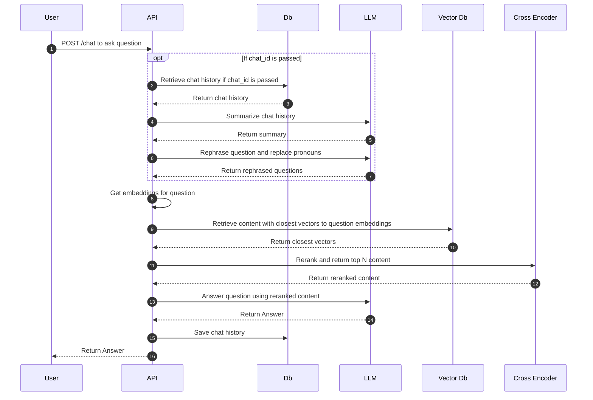

You can call the `/chat` endpoint to ask questions. If a `chat_id` is passed, the endpoint will retrieve conversation hhistory and use an LLM to summarize it. It will also rephrase the question and replace any pronouncs with the right nounds to remove any ambiguities.

If no `chat_id` is passed, the endpoint will create a new conversation and return a `chat_id` that can be used for future questions.

See API docs at `http://[DOMAIN]/docs` for more information on JSON request and response formats.

## Diagram

