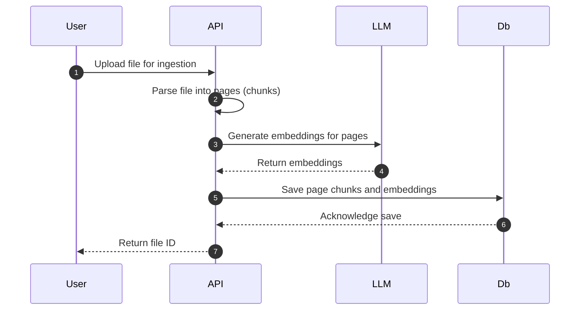

This page details document management, including the ingestion and parsing of files, as well as searching through the files present in the Database.

### Document Ingestion
PDF files are parsed on a per-document, per-page basis. Once broken down into chunks (each of which is a page), a locally hosted model - `Alibaba-NLP/gte-base-en-v1.5` by default - generates vector embeddings for each chunk page. Each page/ chunk, with its metadata and embedding, is stored in the PostgreSQL database using vector indexing for efficient similarity search.

#### Tip: All ingested documents can be easily viewed with their metadata by querying the `list_docs` `GET` endpoint.

**N.B. Ingestion required administrator priveleges, whilst search will be available to all end users & administrators.**
